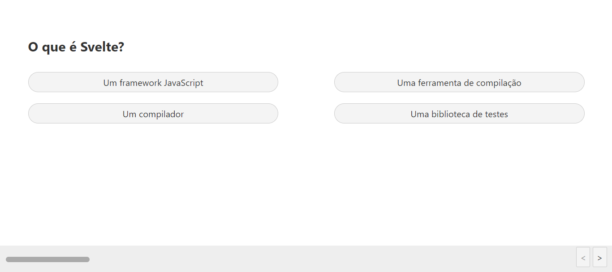
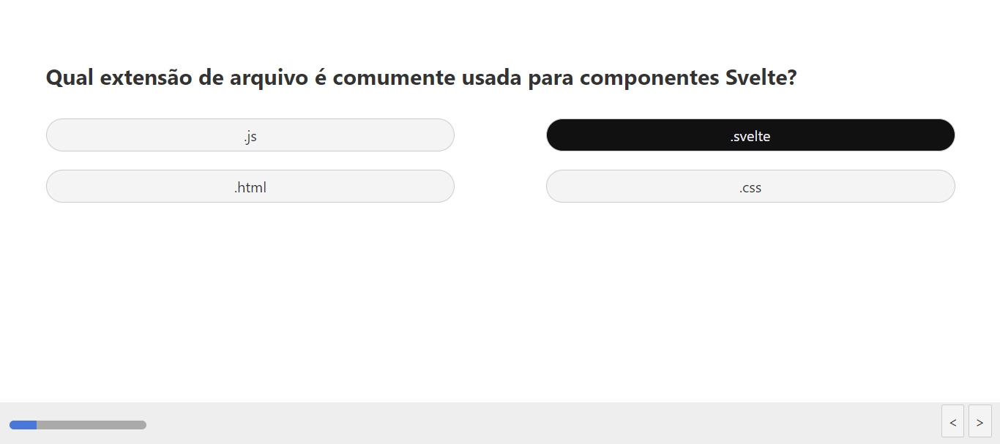
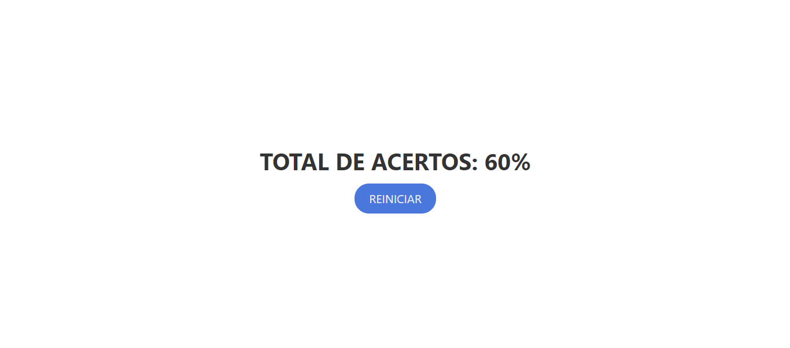
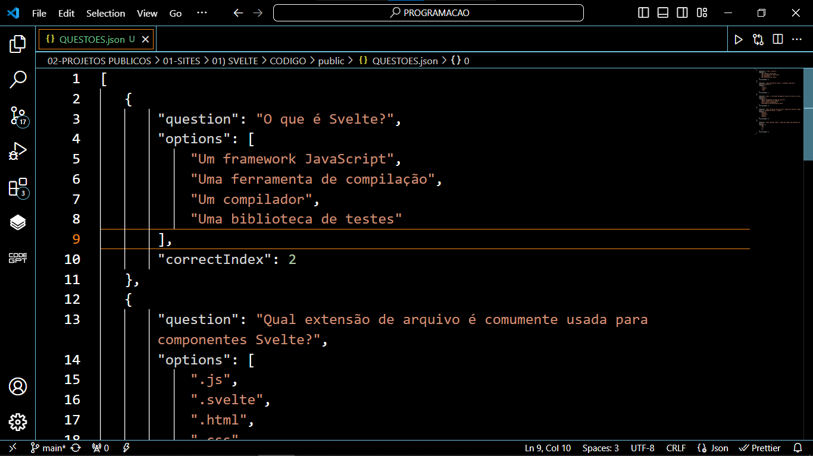

# QUIZ COM SVELTE
👨‍🏫APP DE ENQUETES QUIZ COM SVELTE E JSON.

 <br> 
 <br> 
 <br> 
 <br>
 <br>

## DESCRIÇÃO:
Este aplicativo é um quiz interativo desenvolvido com o framework Svelte. Ele permite aos usuários responderem uma série de perguntas e receberem uma pontuação com base em suas respostas. O grande diferencial é a flexibilidade oferecida pela integração com o arquivo `QUESTOES.json`, que permite personalizar facilmente as perguntas e respostas de acordo com as necessidades do usuário.

## FUNCIONALIDADES:
1. **Personalização das Perguntas e Respostas:**
   - O aplicativo lê as perguntas e opções de resposta de um arquivo JSON chamado `QUESTOES.json`.
   - Este arquivo JSON pode ser facilmente modificado para incluir novas perguntas, alterar as opções de resposta e ajustar o índice da resposta correta para cada pergunta.

2. **Interface de Usuário Intuitiva:**
   - A interface do usuário é limpa e fácil de usar.
   - Os usuários podem iniciar o quiz clicando em um botão "Iniciar" e navegar pelas perguntas usando botões de navegação.

3. **Feedback:**
   - A pontuação é calculada automaticamente com base nas respostas corretas e incorretas.

4. **Capacidade de Reiniciar o Quiz:**
   - Após concluir o quiz, os usuários têm a opção de reiniciá-lo clicando em um botão "Reiniciar".

## EXECUTANDO O PROJETO:
1. **Instalar as dependências do projeto**:
   - Execute o comando no diretório `CODIGO/`:
     ```cmd
     npm install
     ```
   Este comando instala todas as dependências listadas no arquivo `package.json` do seu projeto. 

2. **Executando o Aplicativo:**
   - Ainda no diretório `CODIGO/`, abra o terminal ou prompt de comando e digite o seguinte comando:
   ```bash
   npm run dev
   ```
   - Acesse o aplicativo no navegador visitando `http://localhost:8080/`.

3. **Usando o APP:**
   1. **Iniciar o Quiz**: Ao carregar a página, você verá um botão "INICIAR". Clique neste botão para começar o quiz.

   2. **Responder às perguntas**: Após clicar em "INICIAR", você será apresentado com uma série de perguntas. Leia cada pergunta cuidadosamente e escolha a resposta que você acredita ser correta. Clique no botão correspondente à sua escolha.

   3. **Navegar pelas perguntas**: Você pode navegar entre as perguntas clicando nos botões "<" e ">" na parte inferior da tela. Isso permite que você revise suas respostas ou pule para a próxima pergunta.

   4. **Finalizar o Quiz**: Depois de responder a todas as perguntas, você verá sua pontuação total exibida na tela. Você também terá a opção de reiniciar o quiz clicando no botão "REINICIAR".

4. **Gerenciando o `QUESTOES.json`:**
   Para gerenciar o `QUESTOES.json` em `./CODIGO/public`, é essencial entender o papel do campo `"correctIndex"` em cada pergunta. Este campo indica o índice da opção correta dentro da lista de opções fornecida para cada pergunta. Aqui está um exemplo prático de como entender e usar o `"correctIndex": 2`:

   Suponha que tenhamos a seguinte pergunta no arquivo `QUESTOES.json`:

   ```json
   {
      "question": "Qual é a capital do Brasil?",
      "options": ["Rio de Janeiro", "Brasília", "São Paulo", "Belo Horizonte"],
      "correctIndex": 1
   }
   ```

   Nesta pergunta, as opções fornecidas são "Rio de Janeiro", "Brasília", "São Paulo" e "Belo Horizonte". O campo `"correctIndex": 1` indica que a opção correta é "Brasília", que está no índice 1 da lista de opções.

   - **question:** Esta chave contém a pergunta do quiz.
   - **options:** Aqui são listadas as opções de resposta para a pergunta.
   - **correctIndex:** Indica o índice da opção correta dentro do array de opções. Lembre-se de que os índices em JavaScript começam com 0.
   - **{...}:** Cada questão no arquivo `QUESTOES.json` é representada por um objeto JSON, delimitado por chaves. Cada objeto contém os campos `question`, `options` e `correctIndex`.
   
## NÃO SABE?
- Entendemos que para manipular arquivos em `HTML`, `CSS` e outras linguagens relacionadas, é necessário possuir conhecimento nessas áreas. Para auxiliar nesse aprendizado, oferecemos cursos gratuitos disponíveis:
* [CURSO DE HTML E CSS](https://github.com/VILHALVA/CURSO-DE-HTML-E-CSS)
* [CURSO DE JAVASCRIPT](https://github.com/VILHALVA/CURSO-DE-JAVASCRIPT)
* [CURSO DE NODEJS](https://github.com/VILHALVA/CURSO-DE-NODEJS)
* [CURSO DE JSON](https://github.com/VILHALVA/CURSO-DE-JSON)
* [CURSO DE SVELTE](https://github.com/VILHALVA/CURSO-DE-SVELTE)
* [CONFIRA MAIS CURSOS](https://github.com/VILHALVA?tab=repositories&q=+topic:CURSO)

## CREDITOS:
- [PROJETO FEITO PELO VILHALVA](https://github.com/VILHALVA)
- [VEJA O VIDEO DESSE PROJETO](https://youtu.be/ZK7oXM-caZo?si=8uwGQKYavBWN5-HL)
- [VEJA O CÓDIGO FONTE DESSE PROJETO](https://codingflag.blogspot.com/2020/10/how-to-create-a-.html)
- [VEJA A PLAYLIST DE PROJETOS](https://youtube.com/playlist?list=PLVGpQnv1Jm4zF85nLVJU2hvqg3CBa6QQd&si=64Ou6dIY4dYhOlEd)


